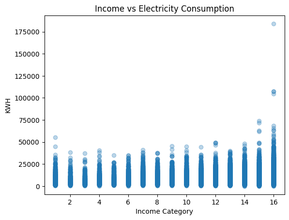
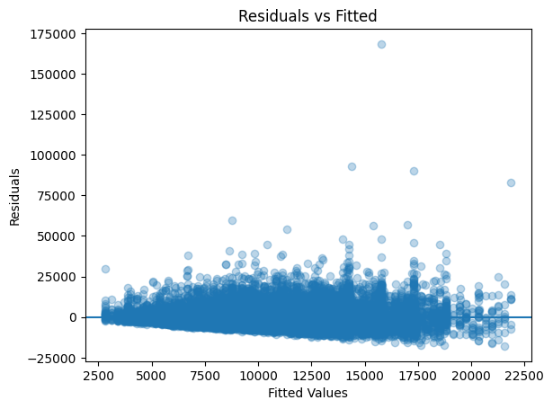

<div align="center">

# 📊 Statistical Analysis of Residential Electricity Consumption in the United States
### Evidence from the 2020 Residential Energy Consumption Survey (RECS)
**U.S. Energy Information Administration**

<br>


<br>

| | |
|:---|:---|
| **Author** | Mokshagna Ratakonda |
| **Institution** | SRM Institute of Science and Technology |
| **Dataset** | RECS 2020 Public Use Microdata v7 — U.S. EIA |
| **Language** | Python 3 · Google Colab |

</div>

---

##  Overview

This project presents a rigorous **statistical analysis of household electricity consumption** across the United States using the 2020 Residential Energy Consumption Survey (RECS) — a nationally representative survey published by the U.S. Energy Information Administration (EIA) covering approximately **18,496 households** across 799 variables.

The study investigates the distributional characteristics, regional variation, socioeconomic determinants, and climate-based predictors of annual residential energy use using **classical statistical inference exclusively** — no machine learning methods are employed. The emphasis is on sound statistical reasoning and meaningful engineering interpretation.

---

##  Research Objectives

- Characterise the distribution of annual residential electricity consumption (kWh)
- Estimate population-level parameters using confidence interval methods
- Test hypotheses regarding regional and socioeconomic differences in energy use
- Quantify the linear association between income and electricity consumption
- Conduct variance analysis (ANOVA) across the four U.S. census regions
- Build and evaluate OLS, robust, log-transformed, and survey-weighted regression models
- Formally test for heteroskedasticity using the Breusch-Pagan test

---

##  Dataset

| Attribute | Details |
|:---|:---|
| **Source** | U.S. Energy Information Administration (EIA) |
| **Survey** | Residential Energy Consumption Survey (RECS) 2020 |
| **File** | `recs2020_public_v7.csv` |
| **Observations** | ~18,496 households |
| **Total Variables** | 799 columns |

| Variable | Description |
|:---|:---|
| `KWH` | Annual household electricity consumption (kilowatt-hours) |
| `MONEYPY` | Annual household income category (ordinal, 1–16) |
| `NHSLDMEM` | Number of household members |
| `REGIONC` | U.S. Census region (Midwest, Northeast, South, West) |
| `NWEIGHT` | Survey sampling weight for population-level estimation |
| `HDD65` | Heating Degree Days — measure of annual heating demand |
| `CDD65` | Cooling Degree Days — measure of annual cooling demand |

>  The dataset is publicly available at [EIA RECS 2020](https://www.eia.gov/consumption/residential/data/2020/)

---

##  Methodology

| Step | Method | Purpose |
|:---|:---|:---|
| 1 | **Descriptive Statistics** | Mean, median, std dev, variance of KWH |
| 2 | **95% Confidence Interval** | Estimate true population mean KWH |
| 3 | **Independent Samples t-test** | Compare South vs. West consumption |
| 4 | **One-Way ANOVA** | Test mean differences across all four regions |
| 5 | **Pearson Correlation** | Quantify income–consumption relationship |
| 6 | **Survey-Weighted Mean** | Adjust for complex sampling design via `NWEIGHT` |
| 7 | **OLS Regression** | Model KWH as a function of income, size, and region |
| 8 | **Residual Diagnostics** | Assess OLS assumptions visually |
| 9 | **Robust Regression (HC3)** | Correct standard errors under heteroskedasticity |
| 10 | **Log-Transformed Regression** | Address right skew in the outcome variable |
| 11 | **Extended Model with Climate** | Add HDD65 and CDD65 as additional regressors |
| 12 | **Breusch-Pagan Test** | Formally test for heteroskedasticity |

---

##  Key Results

### Descriptive Statistics

| Statistic | Value |
|:---|:---|
| Mean (Unweighted) | 10,848.8 kWh |
| Median | 9,346.4 kWh |
| Standard Deviation | 7,111.8 kWh |
| Variance | 50,577,203 kWh² |
| **Survey-Weighted Mean** | **10,565.8 kWh** |
| 95% Confidence Interval | (10,746.3 kWh, 10,951.3 kWh) |

### Hypothesis Tests

| Test | Statistic | p-value | Decision |
|:---|:---|:---|:---|
| t-test (South vs. West) | t = 28.93 | ≈ 2.08 × 10⁻¹⁷⁷ | Reject H₀ |
| One-Way ANOVA (all regions) | F = 563.60 | ≈ 0.0 | Reject H₀ |
| Breusch-Pagan Test | BP = 99.55 | ≈ 6.57 × 10⁻²⁰ | Heteroskedasticity confirmed |

### OLS Regression — Model Summary

**Specification:** `KWH ~ MONEYPY + NHSLDMEM + C(REGIONC)` · Midwest as reference category

| Predictor | Coefficient | p-value | Interpretation |
|:---|:---|:---|:---|
| Intercept | +2,939.3 | < 0.001 | Baseline (Midwest) |
| Northeast | −2,011.5 | < 0.001 | Lower than Midwest |
| South | +3,597.0 | < 0.001 | Higher than Midwest |
| West | −1,589.9 | < 0.001 | Lower than Midwest |
| Income (`MONEYPY`) | +297.5 | < 0.001 | kWh per income bracket increase |
| Household Size (`NHSLDMEM`) | +1,487.1 | < 0.001 | kWh per additional member |

**R² = 0.224** — Region, income, and household size collectively explain ~22% of the variance in annual electricity consumption.

---

##  Visualisations & Analysis

The following four figures are generated in the analysis notebook. Each chart is presented alongside a detailed explanation of what it shows, how to read it, and what the results mean statistically.

---

### Figure 1 — Distribution of Annual Electricity Consumption

<p align="center">
  
</p>

**What the chart shows:** This histogram plots the frequency of annual electricity consumption (`KWH`) across all sampled U.S. households using 50 equal-width bins. The x-axis spans from 0 to approximately 175,000 kWh, while the y-axis represents the count of households falling within each bin interval.

**Interpretation:** The distribution is strongly **right-skewed (positively skewed)** — the vast majority of U.S. households consume between 2,000 and 20,000 kWh per year, with the mode appearing in the 5,000–10,000 kWh range. A small but notable proportion of high-consumption households extend the tail well beyond 50,000 kWh. This skewness is numerically confirmed by the gap between the mean (10,849 kWh) and the median (9,346 kWh) — the mean is pulled upward by extreme high-consumption outliers that the median is immune to.

**Statistical implication:** The pronounced right skew signals a departure from normality in the outcome variable. This motivates the log-transformation model applied later in the analysis, which compresses the long tail and produces more symmetric, better-behaved residuals. It also explains why the survey-weighted mean (10,566 kWh) is lower than the unweighted mean — high-consumption households are slightly overrepresented in the raw sample relative to the national population.

---

### Figure 2 — Electricity Consumption by U.S. Census Region

<p align="center">
  
</p>

**What the chart shows:** Side-by-side box plots display the full distribution of annual electricity consumption (`KWH`) for each of the four U.S. census regions — Midwest, Northeast, South, and West. Each box spans the interquartile range (IQR = Q3 − Q1), the horizontal line inside the box marks the median, whiskers extend to 1.5× IQR beyond each quartile, and individual points beyond the whiskers are plotted as outliers.

**Interpretation:** The **South** has the highest median consumption and the widest IQR, indicating both greater average use and more variation across Southern households. The **Northeast** is the most energy-efficient region, displaying the lowest median, the narrowest spread, and the fewest extreme outliers. The **Midwest** and **West** occupy intermediate positions with broadly similar distributions. All four regions contain a substantial number of high-consumption outliers, reflecting heterogeneity in dwelling size, appliance inventory, and local climate conditions within each region.

**Statistical implication:** The clear visual separation between regional distributions is formally confirmed by the One-Way ANOVA (F = 563.60, p ≈ 0), which rejects the null hypothesis that all regional means are equal. The boxplot makes evident that this result is not merely a statistical artefact — the South is a genuinely distinct high-consumption region, largely attributable to higher cooling degree days (CDD65) and the near-universal adoption of electric air conditioning across Southern states.

---

### Figure 3 — Income Category vs. Annual Electricity Consumption

<p align="center">
  
</p>

**What the chart shows:** A scatter plot of household income category (`MONEYPY`, ordinal scale 1–16) on the x-axis against annual electricity consumption (`KWH`) on the y-axis. Transparency (alpha = 0.3) is applied to reveal the density of overlapping data points. Each vertical column of points represents all surveyed households within a given income bracket, from the lowest income category (1) to the highest (16).

**Interpretation:** A weak but discernible **upward trend** is visible across income brackets — higher income categories are associated with moderately higher electricity consumption and a broader vertical spread of individual values. The Pearson correlation coefficient (r = 0.191) confirms a statistically significant positive but weak linear relationship. The bulk of households cluster between 0 and 40,000 kWh across all income brackets, with sporadic extreme outliers appearing most prominently in the upper income categories (14–16).

**Statistical implication:** The increasing vertical spread of data points at higher income levels is a visual diagnostic for **heteroskedasticity** — the variance of electricity consumption is not constant across income groups but grows systematically with income. This observation is formally confirmed by the Breusch-Pagan test (BP = 99.55, p ≈ 6.57 × 10⁻²⁰), which rejects the null hypothesis of constant error variance. As a result, standard OLS standard errors are invalid and HC3 heteroskedasticity-robust standard errors are applied in the regression analysis.

---

### Figure 4 — Residuals vs. Fitted Values

<p align="center">
  
</p>

**What the chart shows:** A regression diagnostic scatter plot of OLS model residuals (observed KWH minus predicted KWH) on the y-axis against the model's fitted (predicted) values on the x-axis. The horizontal reference line at zero represents the ideal case where predicted and observed values are identical. This plot is one of the most critical tools for validating the assumptions underlying OLS regression.

**Interpretation:** The residuals display a pronounced **fan-shaped (heteroskedastic) pattern** — at low fitted values (left side), residuals cluster tightly around zero, while at higher fitted values the vertical spread increases dramatically, reaching residuals exceeding +150,000 kWh. This means the model's prediction errors grow with the level of predicted consumption — the model is far less precise for high-consumption households than for average ones. Additionally, several large positive residuals at the upper end of the fitted range indicate the presence of highly influential outliers that the model systematically under-predicts.

**Statistical implication:** This fan-shaped pattern is a textbook signature of a violation of the OLS **homoskedasticity assumption**. While heteroskedasticity does not bias the coefficient estimates — they remain unbiased and consistent — it renders the standard errors, t-statistics, p-values, and confidence intervals unreliable, potentially leading to incorrect inference. The corrective action taken in this analysis is the application of **HC3 heteroskedasticity-consistent (robust) standard errors**, which produce valid inference without requiring constant error variance. This finding is also formally corroborated by the Breusch-Pagan test reported in the notebook.

---

##  Repository Structure

When cloning or downloading this project, ensure your directory matches the following structure so that all image references in the README render correctly on GitHub:

```
 Statistical-Analysis-of-U.S.-Residential-Electricity-Consumption-RECS-2020/
│
├──  statistics.ipynb                     
├──  README.md                           
│
├──  figures/                           
│   ├──   fig1_kwh_distribution.png      
│   ├──   fig2_regional_boxplot.png      
│   ├──   fig3_income_vs_kwh.png     
│   └──   fig4_residuals_vs_fitted.png            
```

>  **Note:** The dataset `recs2020_public_v7.csv` is **not included** in this repository due to its size. Download it directly from the [EIA RECS 2020 page](https://www.eia.gov/consumption/residential/data/2020/) and place it inside the `data/` folder before running the notebook.

---

##  Requirements

Developed in **Google Colab** with Python 3. To run locally, install the following dependencies:

```bash
pip install pandas numpy scipy statsmodels matplotlib seaborn
```

| Library | Version | Purpose |
|:---|:---|:---|
| `pandas` | ≥ 1.5 | Data loading and manipulation |
| `numpy` | ≥ 1.23 | Numerical operations |
| `scipy` | ≥ 1.9 | Statistical tests (t-test, ANOVA) |
| `statsmodels` | ≥ 0.14 | OLS/WLS regression, Breusch-Pagan test |
| `matplotlib` | ≥ 3.6 | Data visualisation |

---

##  Usage

1. Clone this repository or download it as a ZIP
2. Download `recs2020_public_v7.csv` from the [EIA website](https://www.eia.gov/consumption/residential/data/2020/) and place it in the `data/` folder
3. Open `stat.ipynb` in **Google Colab** or **Jupyter Notebook**
4. If running locally, update the file path in Cell 2 to point to your local `data/` directory
5. Run all cells sequentially (`Runtime → Run all` in Colab)

---

##  Conclusions

1. **Regional location** is the most impactful categorical predictor — Southern households consume ~62% more electricity per year than those in the Northeast, primarily driven by high cooling demand and warmer climates.
2. **Household size** is the strongest continuous predictor, contributing approximately 1,487 kWh per additional household member — reflecting the direct relationship between occupancy and the volume of energy services demanded.
3. **Income** exerts a weak but statistically significant positive effect — higher-income households consume modestly more electricity, consistent with larger dwelling sizes and greater appliance ownership.
4. **Cooling demand** (CDD65 coefficient = 1.05) has a 3× larger unit effect than heating demand (HDD65 = 0.35), confirming that electric air conditioning is the dominant climate-driven energy expenditure in U.S. residential settings.
5. **Heteroskedasticity** is present and formally confirmed — OLS standard errors are not reliable without correction, and HC3 robust standard errors are necessary for valid statistical inference.

These findings carry practical implications for **energy policy design**, **utility demand forecasting**, and **residential energy efficiency programmes** targeting high-consumption demographic and geographic segments.

---

##  References

- U.S. Energy Information Administration. (2020). *Residential Energy Consumption Survey (RECS)*. https://www.eia.gov/consumption/residential/
- Wooldridge, J. M. (2019). *Introductory Econometrics: A Modern Approach* (7th ed.). Cengage Learning.
- Seabold, S., & Perktold, J. (2010). Statsmodels: Econometric and statistical modeling with Python. *Proceedings of the 9th Python in Science Conference*.
- Breusch, T. S., & Pagan, A. R. (1979). A simple test for heteroscedasticity and random coefficient variation. *Econometrica*, 47(5), 1287–1294.
- White, H. (1980). A heteroskedasticity-consistent covariance matrix estimator and a direct test for heteroskedasticity. *Econometrica*, 48(4), 817–838.

---

<div align="center">

*This project was completed as part of academic coursework at SRM Institute of Science and Technology.*  
*All analysis is conducted on publicly available data for educational and non-commercial purposes.*

</div>
